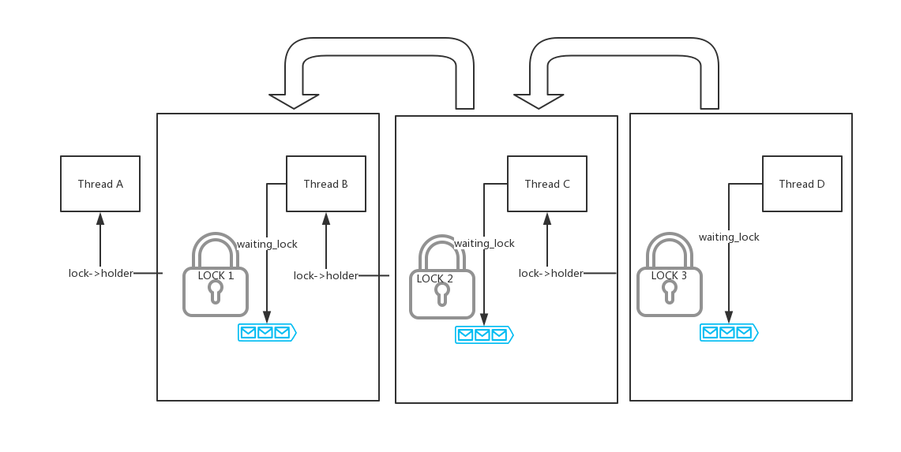

# Final Report for Project 1: Threads
===================================

## Alarm Clock
There was a significant misunderstanding when it came to what needed to be implemented for the efficient alarm clock prior to the design review.  The original belief was simply that `timer_sleep()` needed to be modified to change a thread's status to blocked if it wasn't already and to unblock it after a certain amount of time had passed without returning from the function until after the thread has been unblocked.  After the design review, the plan for the efficient alarm clock added the use of a sorted list of sleeping threads that would be added to in `timer_sleep()` and taken away from in `timer_interrupt()` according to the value of a new member of the thread struct, `wake_time`.  When added to the list of sleeping threads, the current thread would avoid being placed on the `ready_list` and would only be on the `all_list` and `sleep_list` while it is sleeping.  Meanwhile, `timer_interrupt()` would be repeatedly called and move any threads that had a `wake_time` in the past off of the `sleep_list` and back onto the `ready_list` unblocked.

## Priority Donation
Originally, the plan was to have the default scheduler use a list of all of the threads attempting to acquire a lock and to use the *sema_up* and *sema_down* threads to manipulate the priorities of threads as they acquired locks.  After the design review, the decision was made to instead create additional members of the thread struct, including an entirely new priority donation struct, to keep track of the various donations.  Additionally, the default implementations of *sema_up* and *sema_down* were mostly kept intact and new functions were added to keep track of the synchronization between different threads as they interact with locks.

## Priority Scheduler 

* Initially, the thought was to create a new tree data structure to represent the priority queue. This was eventually determined to be very troublesome and time consuming. This data structure was intended to maintian a max heap which would have always popped out the thread with the highest priority and minimized the overhead of `next _thread_to_run` in the long run.   However, in the final code, the decision was made to abandon the new tree data structure and instead make use of the existing linked list struct and associated operations to organize the threads with different priorities.
* Adding the `thread_yield` call at the end of function `create_thread` and `thread_set_priority` solved two significant edge cases that failed with the original design. One case had a low priority thread creates a high priority thread and a second low priority thread need to yield the cpu immediately. A second case had a high priority thread set it's own priority lower than the second largest priority of a thread in `ready_list`.
* The orginal design included using local variables to record every priority donation. However, when implementing the format described in the design doc, it turned out that it was necessary to handle changing a priority and restoring it in two separate functions. Instead of using a global variable to record the donation and sacrificing code readability, the priority dontion is recorded within the threads themselves since the priority donation would only affect the thread which receive the donation.
* It was assumed that it was important to modify the stratrety of finding the next thread in the waiting list of condition variables, locks, and semaphores to satisfy the requirement of finding the thread with the highest priority. However it was eventually determined that the only pertinent function for this task was `next_thread_to_run`.
* `thread_foreach` is now used to check all of the threads in `all_list` to find the owner of a lock. If an owner is found,  a priority donation will occur, otherwise the process outlined in the design doc will be followed. An early idea involved a new static list `lock_list` to record every thread which owned a lock and to easily look up who the owner of a given lock was. However, due to difficulty implementing this design, new thread struct members were chosen instead.
* The member variables `own_lock ` and `orginal_priority` were designed to restore the the original priority of a thread after it releases a lock. `lock_own` was repurposed to denote the number of priority donation records stored in `priority_donation[MAX_DONATION_NUM]` and `orginal_priority` was altered to store the priority when `thread_set_priority` is called, but the current thread already owns locks.
* In the priority donation function `void thread_check_donate_priority(struct thread *thread, void *lock)`, the preliminary thought of having a thread set its own priority level by using the newly defined `struct priority_donation` inside of the thread struct was abandoned. Instead, data structures like `struct priority_donation priority_donation[MAX_DONATION_NUM]` were added to keep track of the priority level. 
* A new function built to handle priority donation chains was created. The pointer `waiting_lock` was added to denote the lock that a thread is waiting for. <br /> For exmaple, locks s1, 2, and 3 and threads A, B, C, and D, which have lowest to highest priority respectively. Thread A with lock 1, thread B has lock 2, thread C has lock 3, thread D has no lock. <br />

In any case where a chain donation is involved, `void thread_do_donate_priority(struct lock* lock,int priority_donation)` will be used to recursively donate the priority. 
* `struct list_elem* list_max_thread(struct list *list)` loops through all of the elements of a list to find the thread with the highest priority. 


## MLFQS
The following functions were all modified or added to fully implement the MLFQS:

```
struct thread //Add recent_cpu and nice_value members
static struct thread *next_thread_to_run(void); //Choose the thread with the highest calculated priority to run
void schedule(); //Enable MLFQS functionality
void thread_ticks(); //Update the load average, recent cpu, and priority at the appropriate intervals
int thread_get_nice(void)  //Get the thead`s nice value
void thread_set_nice(int new_nice) //Set the thread`s nice value
int thread_get_recent_cpu(void) //Get recent cpu time
int thread_get_load_avg(void) //Get load average


fixed_point_t load_avg //Store the load average 
void update_all_recent_cpu(struct thread* t,void *aux UNUSED) //Update all threads' recent cpu usage
void thread_calculate_priority(struct thread* t,void *aux UNUSED) //Update all threads' prioirty
```

When implementing the load average calculation, the first design was to store `load_average` as an integer 100 times its real value. That meant every time the calculation was done, it needed to cast it into fixed point real, then unscale by 100, the scale by 100 and round to integer after the calculation is done. We did not foreseen the expensive calculation would crash the timer and leads to a series of failure in the designing phrase, so deugging this case have consumed a heavy waste on time and effort.

## Reflection and improvment

Josh handled the efficient alarm clock, integration of the code between the three different tasks, and polishing the design doc and final report. 
Zuxin worked on implementing the MLFQS scheduler, including calculate load average, recent cpu and thread priority， and writing the MLFQS portion of the documents.
Handi and Gary focused on creating the default scheduler, lock acquisition/release, and priority donation when multiple threads attempt to acquire the same lock, designing the scheduler and priority donation part, and filling them in for the documents.

The group members have all put a great effort in finishing this projecet. For example, implementing their parts, Josh and Gary often stayed up until 4 A.M. or later, while all members sacrificed their weekends for the project. Everyone is satisfied with the amount of effort we put into the project. One of the major areas to improve upon is the skill for code review. At first, Zuxin had a lot of misunderstandings about how the MLFQS scheduler worked and Josh did not realize the full scope of the efficient alarm clock. Zuxin had no idea how threads were removed from the `ready_list` resulting in a variety of changes while first developing the code. Furthermore, not all of the group members were familiar with git. When working on different tasks simutaneously, the code was pushed from three different sources causing a lot of merge confilicts. Following the reccomendation of the TA, the code was eventually split up into different branches and merged only after the individual parts were completed.

The scheduler works fine with time complexity O(n),f but for the limited threads in pintos ,it will not cost much to check all of the threads in `ready_list`.  It isn't necessary to go through all of the threads contained in the `all_list` to find the owner of a lock. Instead the original plan of creating a new list to record the owner of a lock might save some execution time, especially if there is a lot of threads in the system but few of them own a lock.


